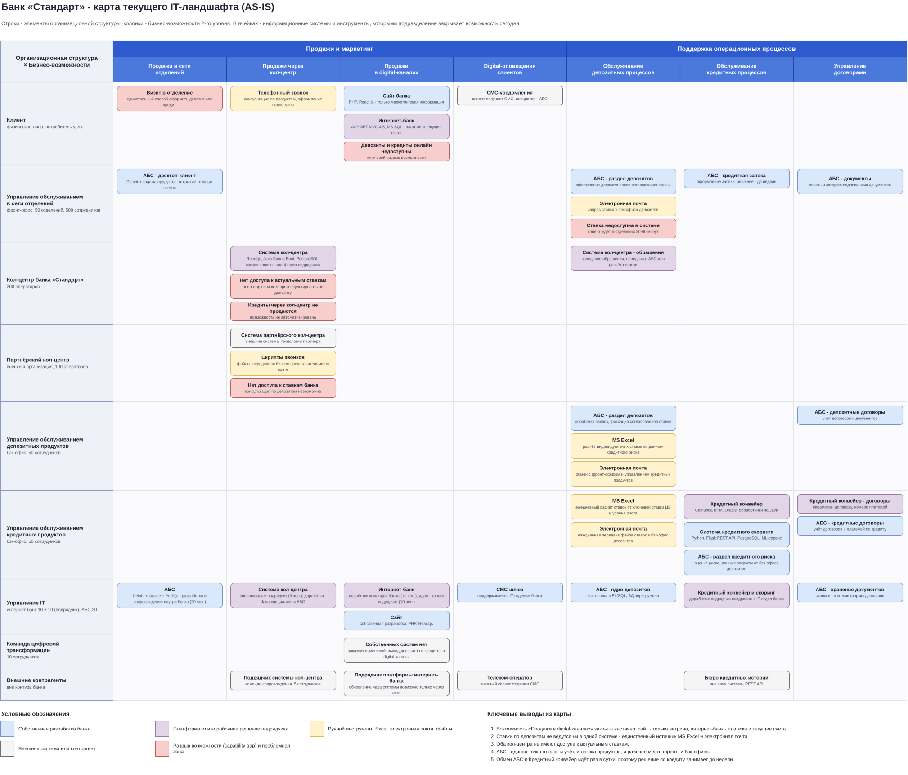
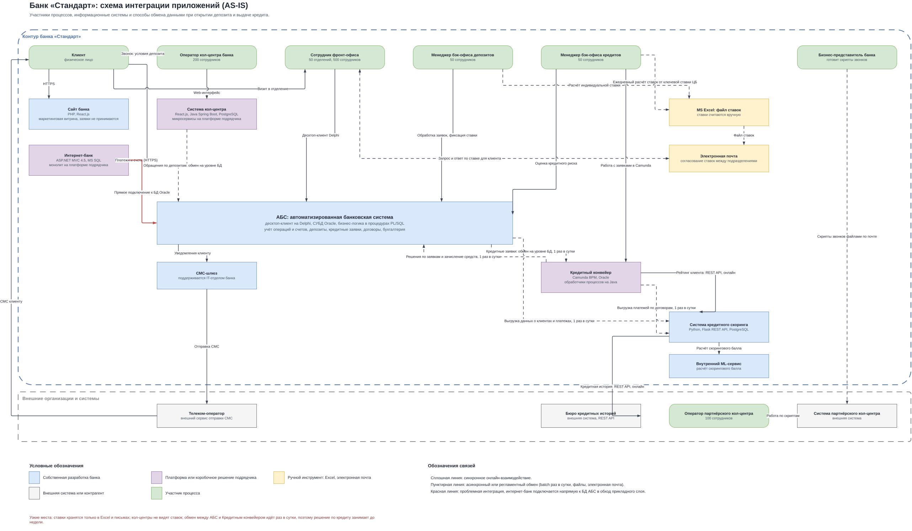

# Задание 1. Карта IT-ландшафта и схема интеграции приложений

## Карта текущего IT-ландшафта

Строки - элементы организационной структуры, колонки - бизнес-возможности 2-го уровня, в ячейках - системы и инструменты, которыми подразделение закрывает возможность сегодня.

Колонки взяты из Business Capability Map. К шести исходным возможностям добавлена седьмая - «Продажи в digital-каналах». В карте возможностей её нет, но сайт и интернет-банк уже частично её закрывают, а цифровая трансформация нацелена именно на неё. На карте она помечена как разрыв: сайт работает только как витрина, интернет-банк умеет платежи и текущие счета, депозиты и кредиты онлайн недоступны.

Кроме семи направлений оргструктуры в строки добавлены ещё три: «Клиент» - показывает, какими каналами пользуется потребитель услуг; «Партнёрский кол-центр» - в схеме оргструктуры его нет, но в процессах он участвует; «Внешние контрагенты» - телеком-оператор, бюро кредитных историй, подрядчики платформ.

Цвет плашки означает тип системы: собственная разработка банка, платформа подрядчика, ручной инструмент (Excel и электронная почта), внешняя система, разрыв возможности.

Исходник: [task1-it-landscape-as-is.drawio](task1-it-landscape-as-is.drawio)

## Схема интеграции приложений

На схеме показаны участники процессов, информационные системы и способы обмена данными. Тип линии означает характер обмена: сплошная - синхронное онлайн-взаимодействие, пунктирная - регламентный или файловый обмен, красная - проблемная интеграция интернет-банка напрямую с базой данных АБС.

Исходник: [task1-application-integration-as-is.drawio](task1-application-integration-as-is.drawio)

### Кредитный процесс на схемах

Кредитный процесс показан на обеих схемах отдельным контуром:

1. Заявка оформляется менеджером отделения в АБС.
2. Раз в сутки заявки уходят из АБС в Кредитный конвейер обменом на уровне баз данных.
3. Управление кредитных продуктов разбирает заявки в конвейере, тот синхронно вызывает систему кредитного скоринга по REST API.
4. Скоринг работает на трёх источниках: суточная выгрузка из АБС, суточная выгрузка номеров платежей по договорам из конвейера, онлайн-запрос в бюро кредитных историй. Итоговый балл считает внутренний ML-сервис.
5. Одобренные заявки раз в сутки возвращаются в АБС, где проводится зачисление средств.

Два суточных обмена подряд дают срок решения до недели, поэтому цель «решение за один день» текущей архитектурой недостижима.
