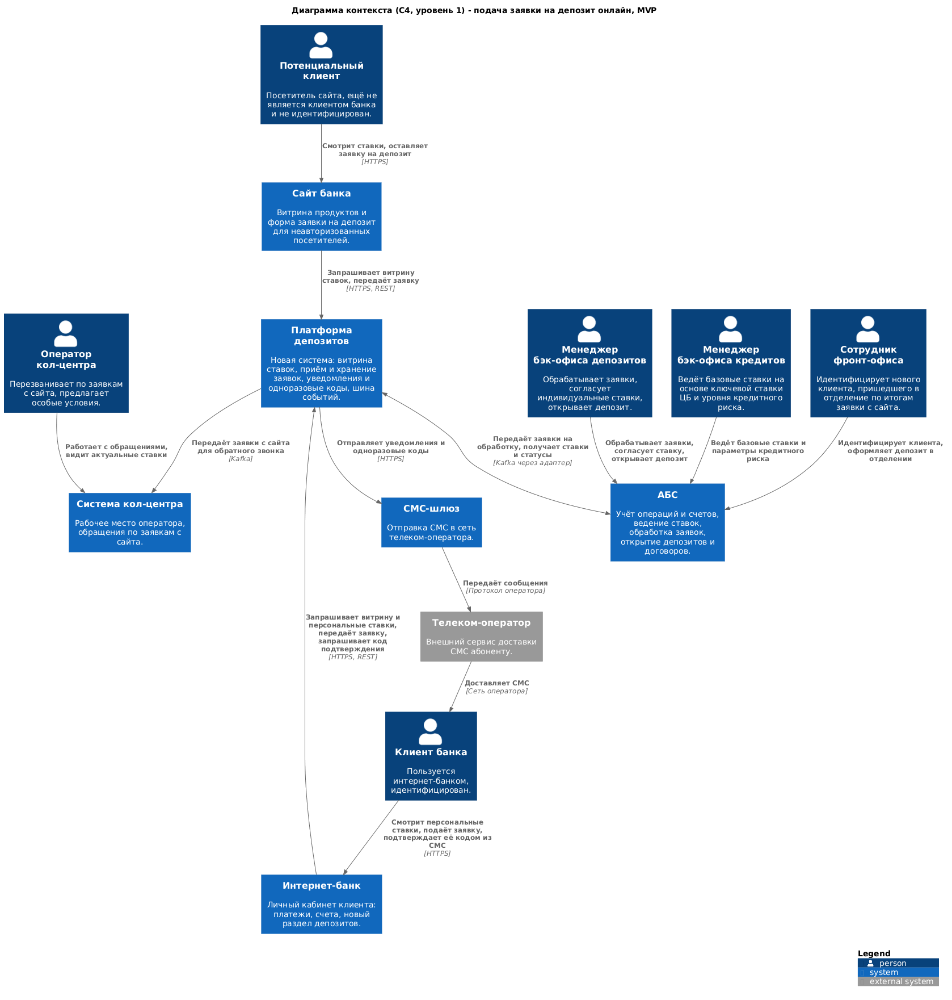
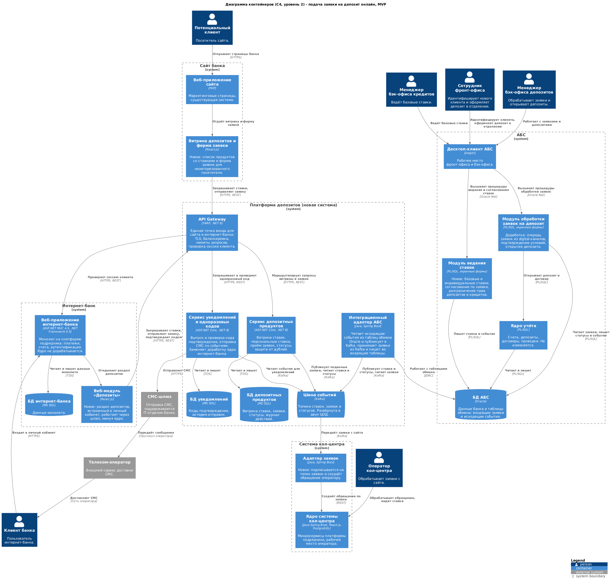

### Название задачи: подача заявки на депозит в интернет-банке и на сайте, MVP

### Автор: Vladislav

### Дата: 08.08.2026

### Функциональные требования

| **№** | **Действующие лица или системы** | **Use Case** | **Описание** |
| :-: | :- | :- | :- |
| 1 | Потенциальный клиент, Сайт банка, Платформа депозитов | Просмотр депозитов и ставок на сайте | 1. Посетитель открывает страницу депозитов. 2. Витрина запрашивает у платформы депозитов список продуктов и базовых ставок. 3. Платформа отдаёт данные из своей витрины. Обращения к АБС при этом не происходит |
| 2 | Потенциальный клиент, Сайт банка, Платформа депозитов, Система кол-центра | Подача заявки на депозит с сайта | 1. Посетитель выбирает продукт, указывает Ф. И. О. и номер телефона. 2. Шлюз проверяет обращение на признаки автоматизированного и ограничивает частоту запросов. 3. Платформа сохраняет заявку и публикует событие о её подаче. 4. Адаптер системы кол-центра создаёт обращение оператору. 5. Посетитель видит сообщение о том, что с ним свяжется менеджер |
| 3 | Оператор кол-центра, Система кол-центра | Обратный звонок по заявке с сайта | 1. Оператор получает обращение в своей системе. 2. Видит выбранный продукт, ставку и данные заявки. 3. Перезванивает клиенту, при необходимости предлагает особые условия. 4. Сообщает о необходимости прийти в отделение для идентификации |
| 4 | Потенциальный клиент, Сотрудник фронт-офиса, АБС | Идентификация нового клиента в отделении | 1. Клиент приходит в отделение с документами. 2. Сотрудник фронт-офиса проверяет документы и заводит клиента в АБС. 3. Оформляет депозит по согласованным условиям |
| 5 | Клиент банка, Интернет-банк, Платформа депозитов | Просмотр ставок и персональных условий в интернет-банке | 1. Клиент открывает раздел депозитов. 2. Веб-модуль обращается к шлюзу. 3. Шлюз проверяет сессию клиента в интернет-банке. 4. Платформа отдаёт базовые ставки и персональную ставку клиента из своей витрины |
| 6 | Клиент банка, Интернет-банк, Платформа депозитов, СМС-шлюз | Подача заявки на депозит в интернет-банке | 1. Клиент выбирает продукт, счёт списания и сумму. 2. Платформа фиксирует действующую ставку и создаёт черновик заявки. 3. Сервис уведомлений выпускает одноразовый код и отправляет его СМС. 4. Клиент вводит код, сервис проверяет его. 5. Заявка переходит в статус «подана», публикуется событие. 6. Повторная отправка той же заявки дубликата не создаёт |
| 7 | Платформа депозитов, АБС | Доставка заявки в АБС | 1. Интеграционный адаптер читает событие из шины. 2. Записывает заявку во входящие таблицы обмена в Oracle. 3. Заявка попадает в очередь модуля обработки заявок на депозит |
| 8 | Менеджер бэк-офиса кредитов, АБС | Ведение базовых ставок | 1. Менеджер открывает модуль ведения ставок. 2. Вводит сетку ставок по срокам и суммам с учётом ключевой ставки ЦБ и уровня кредитного риска банка. 3. Ставки сохраняются, формируется событие об их изменении |
| 9 | Менеджер бэк-офиса депозитов, Менеджер бэк-офиса кредитов, АБС | Согласование индивидуальной ставки по заявке | 1. Менеджер депозитов открывает заявку и запрашивает индивидуальные условия. 2. Запрос попадает менеджеру кредитов, который видит только параметры кредитного риска, без данных депозитного портфеля. 3. Менеджер кредитов подтверждает допустимую надбавку. 4. Менеджер депозитов фиксирует итоговую ставку по заявке |
| 10 | Менеджер бэк-офиса депозитов, АБС | Обработка заявки и открытие депозита | 1. Менеджер открывает заявку из очереди. 2. Подтверждает условия депозита. 3. Открывает депозит и договор в ядре учёта. 4. АБС формирует события о подтверждении ставки и об открытии депозита |
| 11 | Платформа депозитов, СМС-шлюз, Телеком-оператор, Клиент банка | Уведомление клиента о ходе обработки | 1. Сервис уведомлений читает событие из шины. 2. Формирует текст сообщения. 3. Отправляет СМС через шлюз и телеком-оператора клиенту |
| 12 | Клиент банка, Интернет-банк, Платформа депозитов | Просмотр статуса заявки | 1. Клиент открывает раздел депозитов. 2. Видит текущий статус заявки: подана, на рассмотрении, ставка подтверждена, депозит открыт, отказ |
| 13 | АБС, Платформа депозитов, Система кол-центра | Публикация ставок во все каналы | 1. АБС записывает событие изменения ставок в исходящие таблицы обмена. 2. Адаптер публикует событие в шину. 3. Витрина платформы обновляется, новые ставки становятся доступны сайту, интернет-банку и системе кол-центра |

### Нефункциональные требования

| **№** | **Требование** |
| :-: | :- |
| 1 | Доступность сервисов подачи заявок 99,9%, режим работы 24/7 (R1) |
| 2 | Новые сервисы развёрнуты в двух ЦОД и обслуживают запросы одновременно, при отказе площадки приём заявок сохраняется (R2, R3) |
| 3 | Недоступность АБС не блокирует приём заявок: заявка принимается, сохраняется и обрабатывается позже (R4) |
| 4 | Передача заявок и событий между системами выполняется без потерь, с повторными попытками доставки (R6) |
| 5 | Онлайн-подача заявок не увеличивает нагрузку на базу данных АБС (P3) |
| 6 | Отклик пользовательских операций измеряется миллисекундами, списки продуктов и справочники отдаются быстрее одной секунды (P1, P2) |
| 7 | Новые сервисы масштабируются горизонтально, запросы распределяются между экземплярами и ЦОД (P4) |
| 8 | Архитектура выдерживает пиковый рост числа заявок после запуска маркетинговой кампании (P8) |
| 9 | Прямая работа интернет-банка с API и базой данных АБС в новом процессе не допускается (+R6) |
| 10 | Ядро платформы интернет-банка не дорабатывается, работа с СМС выносится за его пределы (F8, S5, +R8) |
| 11 | Текущая версия платформы интернет-банка несовместима с Kafka, работа с очередями выполняется вне монолита (S3, +R9) |
| 12 | Ставки ведутся в информационной системе с разграничением прав между бэк-офисом депозитов и бэк-офисом кредитов (F9, F10, +R4) |
| 13 | Ставка фиксируется в момент подачи заявки и не меняется при последующем пересчёте базовых ставок (F28) |
| 14 | Повторная отправка одной и той же заявки не создаёт дубликат (F27) |
| 15 | Трафик сайта и интернет-банка защищается шифрованием, персональные данные маскируются в журналах (+R1, +R2) |
| 16 | Публичные формы защищены от автоматизированных обращений (+R14) |
| 17 | В доработках используются технологии, уже применяемые в банке, и стек с имеющейся экспертизой (S1, S2) |
| 18 | По каждой заявке ведётся журнал действий, журналы систем связаны сквозным идентификатором операции (F29, S9) |
| 19 | Для новых сервисов собираются метрики доступности и времени отклика, настроены оповещения (S8) |
| 20 | Готовится документация по архитектуре и интерфейсам для дальнейшего расширения системы (S6) |
| 21 | АБС масштабируется только вертикально, приём онлайн-нагрузки в неё не переносится (+R5) |

### Решение

#### Общая идея

Заявка на депозит принимается новой системой, а не существующими монолитами. Между каналами и АБС появляется платформа депозитов: она хранит витрину ставок, принимает заявки, ведёт их статусы и рассылает уведомления. АБС остаётся системой учёта и местом работы бэк-офиса, но перестаёт быть точкой входа для клиентского трафика.

Ставки перестают жить в файле Excel и переезжают в АБС: там уже есть данные о кредитном риске и разграничение прав между подразделениями, поэтому расчёт остаётся рядом с источником данных. Наружу ставки уходят событиями через шину, поэтому сайт, интернет-банк и система кол-центра работают с локальной копией и не создают нагрузку на Oracle.

Обмен между платформой и АБС асинхронный. АБС пишет исходящие события в таблицы обмена и читает входящие заявки оттуда же, а мост между Oracle и Kafka делает отдельный адаптер. Такой способ не требует переписывать ядро АБС, обходится существующей экспертизой команды и сохраняет транзакционную целостность: событие пишется в ту же транзакцию, что и изменение данных.

#### Диаграмма контекста

Исходник: [task3-c4-context.puml](task3-c4-context.puml)

#### Диаграмма контейнеров

Детализированы интернет-банк, АБС и новая платформа депозитов. Сайт и система кол-центра показаны в объёме, необходимом для сценариев подачи заявки.

Исходник: [task3-c4-containers.puml](task3-c4-containers.puml)

#### Принятые решения и их обоснование

1. **Ставки ведутся в АБС, отдельным модулем.** Расчёт ставки опирается на уровень кредитного риска, который считается в АБС, а требование безопасности запрещает депозитному и кредитному подразделениям видеть данные друг друга. В АБС уже есть модель ролей и рабочее место обоих бэк-офисов, поэтому согласование ставки по заявке реализуется там же и заменяет переписку по электронной почте. Реализация на PL/SQL и экранных формах Delphi укладывается в существующий стек команды АБС.

2. **Витрина ставок вынесена в платформу депозитов.** Клиентские каналы читают ставки из витрины, а не из АБС. Это закрывает требование не нагружать базу данных АБС и даёт время отклика в миллисекундах вместо секунды с лишним, как сейчас на справочниках в платежах. Витрина обновляется событиями, задержка составляет секунды.

3. **Приём заявок вынесен в отдельный сервис.** Сервис депозитных продуктов принимает заявки из обоих каналов, фиксирует ставку на момент подачи, хранит статусы и защищает от дублей по ключу идемпотентности. Заявка сохраняется до того, как её увидит АБС, поэтому недоступность АБС не мешает клиенту подать заявку.

4. **Обмен с АБС только асинхронный, через шину и адаптер.** Kafka выбрана как целевая шина по требованию бизнеса. Адаптер на Java Spring Boot читает исходящие события из таблиц обмена Oracle и публикует их, а входящие заявки записывает в таблицы обмена. Java выбрана потому, что специалисты с этим стеком уже есть в команде АБС, а сама АБС на Delphi и PL/SQL с Kafka работать не может.

5. **Работа с СМС вынесена из ядра интернет-банка.** Одноразовые коды подтверждения и уведомления выпускает отдельный сервис, который сам обращается к СМС-шлюзу. Это снимает необходимость дорабатывать ядро платформы силами подрядчика, а заодно даёт единый механизм уведомлений для событий, которых в АБС не происходит: заявка принята с сайта, заявка принята в интернет-банке.

6. **Раздел депозитов в интернет-банке сделан отдельным веб-модулем.** Модуль на React.js встраивается в личный кабинет и обращается к шлюзу напрямую, минуя монолит. Монолит остаётся владельцем аутентификации: шлюз проверяет сессию клиента через существующий интерфейс платформы. Так требование про Kafka и горизонтальное масштабирование выполняется, хотя сам монолит для этого не приспособлен.

7. **Единая точка входа - API Gateway.** Шлюз терминирует TLS, распределяет запросы между экземплярами сервисов и ЦОД, ограничивает частоту обращений и отсекает автоматизированный трафик на публичной форме сайта. Для сайта и интернет-банка это один контракт, поэтому поведение каналов не расходится.

8. **Заявки с сайта попадают в кол-центр через адаптер.** Система кол-центра построена на микросервисах, платформа допускает расширение, поэтому адаптер подписывается на топик заявок и создаёт обращение оператору. Оператор в том же интерфейсе видит актуальные ставки из витрины.

9. **Стек новых сервисов - .NET 8 и MS SQL.** Владельцем новых сервисов становится команда интернет-банка, у неё экспертиза в C# и опыт эксплуатации MS SQL. Обе технологии уже есть в банке, что закрывает требование к использованию знакомых платформ. Для адаптеров в контурах АБС и кол-центра используется Java, потому что там своя команда и свой стек.

10. **Размещение в двух ЦОД.** Новые сервисы, шина и базы данных разворачиваются на обеих площадках и обслуживают трафик одновременно, балансировка выполняется на уровне шлюза. АБС остаётся в основном ЦОД, поэтому при отказе площадки приём заявок и работа витрины сохраняются, а обработка бэк-офисом приостанавливается до восстановления.

#### Границы MVP

В MVP не входит автоматическое открытие депозита без участия бэк-офиса и работа со ставками в кол-центрах: первое относится к целевому решению на горизонте года, второе рассматривается отдельно. Существующая интеграция интернет-банка с базой данных АБС для платежей сохраняется без изменений, но новыми сценариями не используется и не расширяется.

### Альтернативы

**Реализовать депозиты внутри монолита интернет-банка.** Самый короткий путь по объёму работ: заявка сохранялась бы в MS SQL монолита, а связь с АБС шла через существующее подключение к Oracle. Отклонено, потому что платформа несовместима с Kafka, обновление ядра возможно только силами подрядчика, а монолит не масштабируется горизонтально и живёт в одном ЦОД. Требования по доступности и по нагрузке в этом варианте не выполняются.

**Обращаться из интернет-банка напрямую к API АБС.** Не требует новых сервисов и витрин, данные всегда актуальны. Отклонено прямым требованием бизнеса: база данных АБС перегружена, масштабируется только вертикально, а её недоступность немедленно останавливает продажи во всех каналах.

**Вести ставки в новом сервисе, а не в АБС.** Позволило бы не трогать АБС и сразу получить удобный API. Отклонено, потому что расчёт ставки использует данные кредитного риска из АБС, а согласование индивидуальной ставки требует разграничения прав между двумя подразделениями, которое в АБС уже реализовано. В отдельном сервисе пришлось бы дублировать эти данные и модель доступа, а также построить новый процесс согласования вместо доработки существующего.

**Выгружать ставки файлом из Excel по расписанию.** Минимальные изменения и никакого нового кода в АБС. Отклонено: источником истины остаётся файл на рабочем месте сотрудника, нет разграничения прав, нет истории изменений и нет способа согласовать индивидуальную ставку по конкретной заявке.

**Синхронная интеграция между платформой депозитов и АБС по REST.** Проще в отладке, статус заявки виден сразу. Отклонено: любая недоступность или замедление АБС переносится на клиентские каналы, а нагрузка от онлайн-потока заявок ложится на перегруженную базу данных.

**RabbitMQ вместо Kafka.** Легче в эксплуатации и достаточен для текущих объёмов. Отклонено, потому что бизнес зафиксировал Kafka как целевую шину на перспективу, а вводить две разные технологии обмена в одном ландшафте дороже, чем сразу поставить целевую.

**Kafka Connect вместо собственного адаптера АБС.** Не требует писать код, конфигурируется декларативно. Отклонено для MVP: нужна отдельная инфраструктура и экспертиза, которых в банке нет, а логика преобразования событий и обработки ошибок всё равно потребовала бы разработки. Адаптер на знакомом Java-стеке дешевле в первой итерации.

**Недостатки, ограничения, риски**

1. **Ландшафт усложняется.** Вместо двух систем в сценарии участвуют шесть, включая новую шину. Растёт стоимость эксплуатации, нужны сквозной идентификатор операции, централизованные журналы и мониторинг, иначе разбор инцидентов станет неуправляемым.

2. **Kafka - новая для банка технология.** Требуются компетенции по эксплуатации кластера, настройке репликации между ЦОД и мониторингу отставания потребителей. На время MVP это дополнительный риск сроков.

3. **Витрина ставок отстаёт от АБС.** Задержка доставки события составляет секунды, но в момент массового обновления ставок клиент теоретически может увидеть предыдущее значение. Риск закрыт фиксацией ставки в момент подачи заявки, но расхождение между тем, что видно на витрине, и тем, что подтвердит бэк-офис, остаётся возможным и должно разбираться регламентом.

4. **АБС остаётся единственной точкой обработки.** При отказе основного ЦОД или недоступности АБС заявки продолжают приниматься и накапливаться, но не обрабатываются. Для клиента это выглядит как затянувшееся рассмотрение, поэтому нужен предельный срок накопления и оповещение бэк-офиса.

5. **Ручная обработка в MVP не даёт гарантий по срокам.** Заявка обрабатывается человеком по старому регламенту, поэтому обещать клиенту конкретное время подтверждения ставки нельзя. Это принятое ограничение этапа, снимается в целевом решении.

6. **Зависимость от подрядчиков.** Доработка системы кол-центра выполняется в контуре платформы подрядчика, а проверка сессии клиента опирается на интерфейс платформы интернет-банка. Если штатного интерфейса проверки сессии нет, потребуется доработка ядра силами подрядчика, а это прямое нарушение исходного ограничения и удлинение сроков.

7. **Нагрузка на бэк-офис вырастет.** Онлайн-канал снимает барьер входа, число заявок увеличится, а численность бэк-офиса та же. Требуется приоритизация очереди заявок и оценка пропускной способности до запуска маркетинговой кампании.

8. **Дублирование данных о ставках.** Одни и те же ставки хранятся в АБС и в витрине платформы. Расхождение возможно при сбое доставки событий, поэтому нужны сверка витрины с источником и контроль отставания.

9. **Модуль ставок в АБС увеличивает нагрузку на Oracle.** Нагрузка небольшая, но база уже перегружена. Перед внедрением нужна оценка влияния и, при необходимости, вынесение отчётных запросов на реплику.
