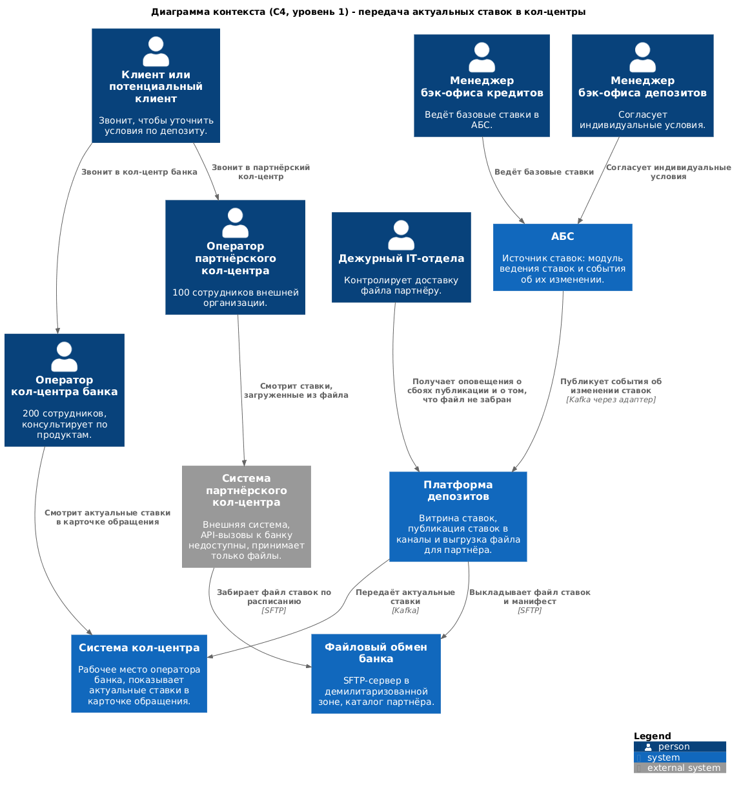
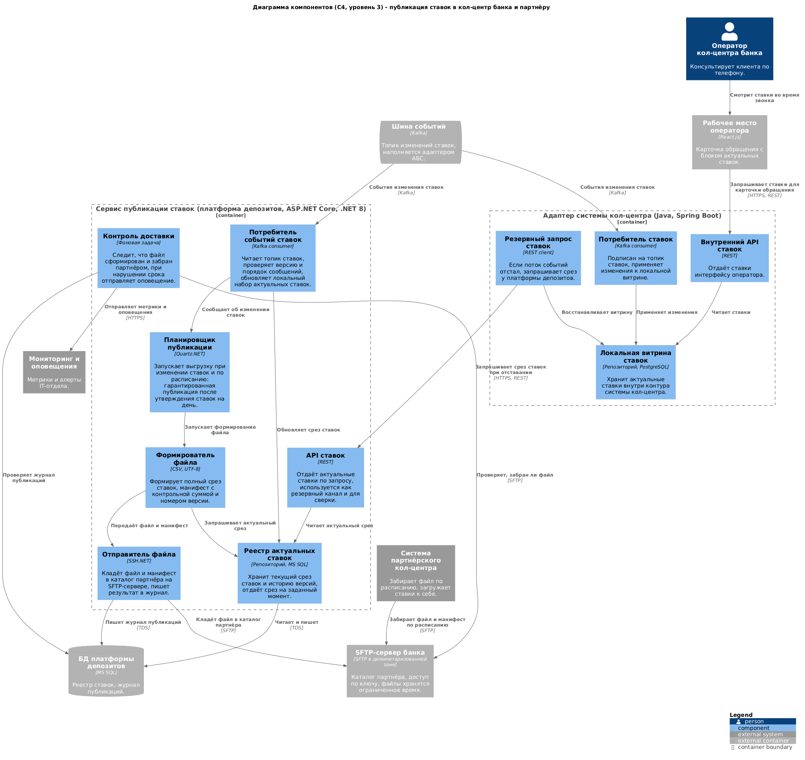
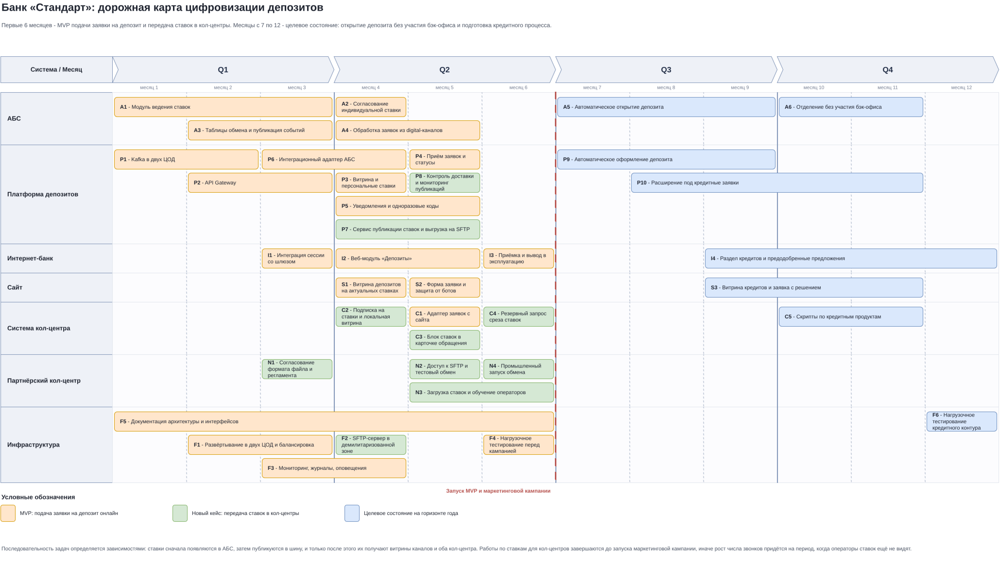

### Название задачи: передача актуальных ставок по депозитам в кол-центр банка и в партнёрский кол-центр

### Автор: Vladislav

### Дата: 08.08.2026

### Функциональные требования

| **№** | **Действующие лица или системы** | **Use Case** | **Описание** |
| :-: | :- | :- | :- |
| 1 | Менеджер бэк-офиса кредитов, АБС, Платформа депозитов | Изменение ставок доходит до всех потребителей | 1. Менеджер утверждает новые ставки в модуле ведения ставок АБС. 2. АБС записывает событие об изменении в исходящие таблицы обмена. 3. Адаптер публикует событие в шину. 4. Сервис публикации ставок и адаптер системы кол-центра обновляют свои копии |
| 2 | Оператор кол-центра банка, Система кол-центра | Консультация клиента по актуальным ставкам | 1. Клиент звонит и спрашивает условия по депозиту. 2. Оператор открывает карточку обращения. 3. В карточке отображаются актуальные ставки по продуктам, сроку и сумме, с отметкой времени актуальности. 4. Оператор называет ставку и фиксирует результат обращения |
| 3 | Платформа депозитов, SFTP-сервер банка | Формирование файла ставок для партнёра | 1. Планировщик получает сигнал об изменении ставок либо срабатывает по расписанию. 2. Формирователь берёт полный срез актуальных ставок. 3. Формирует файл в формате CSV и манифест с номером версии, отметкой времени и контрольной суммой. 4. Отправитель кладёт оба файла в каталог партнёра на SFTP-сервере и пишет запись в журнал публикаций |
| 4 | Система партнёрского кол-центра, SFTP-сервер банка | Получение файла партнёром | 1. Система партнёра по своему расписанию подключается к SFTP-серверу банка. 2. Забирает манифест и файл. 3. Проверяет контрольную сумму и номер версии. 4. Загружает ставки в свою систему. 5. Если контрольная сумма не совпала, файл не применяется и повторно забирается на следующем цикле |
| 5 | Оператор партнёрского кол-центра, Система партнёрского кол-центра | Консультация клиента силами партнёра | 1. Клиент звонит в партнёрский кол-центр. 2. Оператор видит ставки, загруженные из последнего файла, и дату их актуальности. 3. Оператор консультирует по скрипту звонка, оформление продукта не выполняет |
| 6 | Платформа депозитов, Дежурный IT-отдела, Мониторинг | Контроль доставки ставок | 1. Компонент контроля проверяет, что файл сформирован в срок и забран партнёром. 2. Если файл не сформирован либо не забран в течение согласованного времени, формируется оповещение. 3. Дежурный получает оповещение и разбирает инцидент |
| 7 | Дежурный IT-отдела, Платформа депозитов | Повторная публикация файла | 1. Дежурный запускает повторную публикацию через служебный интерфейс. 2. Формируется новый файл с новым номером версии. 3. Событие фиксируется в журнале публикаций |
| 8 | Адаптер системы кол-центра, Платформа депозитов | Восстановление витрины после сбоя | 1. Адаптер обнаруживает отставание или разрыв в последовательности событий. 2. Запрашивает полный срез ставок через API платформы. 3. Заменяет локальную витрину полученным срезом |

Функциональные требования, вытекающие из сценариев:

1. Ставки, утверждённые в АБС, автоматически становятся доступны обоим кол-центрам без ручных действий сотрудников.
2. Оператор кол-центра банка видит ставки в интерфейсе своей системы, а не в отдельном приложении.
3. Рядом со ставкой отображается время, на которое она актуальна.
4. Партнёру передаётся полный срез ставок, а не изменения, чтобы загрузка не зависела от истории предыдущих файлов.
5. Каждый файл сопровождается манифестом с номером версии, отметкой времени и контрольной суммой.
6. Файл формируется при каждом изменении ставок и, кроме того, гарантированно один раз в рабочий день после утверждения ставок.
7. Сохраняется журнал публикаций: что, когда и по какому событию было выгружено.
8. Предусмотрена повторная публикация файла по запросу дежурного.
9. Предусмотрен резервный способ получить срез ставок по запросу, если поток событий отстал.
10. В файле для партнёра передаются только продуктовые условия, персональных данных и данных о клиентах в нём нет.

### Нефункциональные требования

| **№** | **Требование** |
| :-: | :- |
| 1 | Изменение ставки становится видно оператору кол-центра банка не позднее чем через 1 минуту после утверждения в АБС |
| 2 | Файл для партнёра формируется не позднее чем через 15 минут после утверждения ставок и в любом случае один раз в рабочий день |
| 3 | Недоступность платформы депозитов не мешает оператору банка видеть ставки: система кол-центра работает с локальной копией |
| 4 | Недоступность SFTP-сервера не приводит к потере публикации, попытки повторяются до успеха с ограничением по числу и интервалу |
| 5 | Доступность сервиса публикации ставок соответствует общему требованию 99,9% и режиму 24/7 |
| 6 | Целостность переданных данных подтверждается контрольной суммой, частично записанный файл партнёром не применяется |
| 7 | Доступ партнёра к SFTP-серверу ограничен отдельной учётной записью, аутентификацией по ключу и каталогом только своего партнёра |
| 8 | Передаваемый файл не содержит персональных данных, поэтому не требует дополнительных мер защиты, предусмотренных для таких данных |
| 9 | Файлы на SFTP-сервере хранятся ограниченное время и удаляются по регламенту |
| 10 | Формат файла версионируется, изменение структуры согласуется с партнёром заранее и не ломает загрузку прежней версии |
| 11 | Публикация ставок не создаёт дополнительной нагрузки на АБС: сервис работает с событиями и собственным реестром |
| 12 | Отсутствие факта получения файла партнёром обнаруживается автоматически и порождает оповещение |
| 13 | Все действия с публикацией фиксируются в журнале и доступны для разбора инцидентов |
| 14 | Решение выдерживает рост числа обращений в кол-центры после запуска маркетинговой кампании и не зависит от их количества |

### Решение

#### Общая идея

Ставки уже становятся событием: в решении MVP модуль ведения ставок в АБС пишет изменения в таблицы обмена, а адаптер публикует их в шину. Кейс с кол-центрами решается двумя новыми потребителями этих же событий, а не новым источником данных. Ничего в текущем процессе работы бэк-офиса менять не требуется: сотрудник по-прежнему утверждает ставки в АБС.

Кол-центр банка получает ставки внутрь своего контура. Адаптер системы кол-центра подписывается на топик ставок и держит локальную витрину в PostgreSQL, а рабочее место оператора показывает ставки в карточке обращения. Оператор видит данные даже тогда, когда платформа депозитов недоступна, а сама платформа не получает нагрузку от 200 операторов.

Партнёрский кол-центр находится вне контура банка и не может вызывать API, поэтому для него ставки выкладываются файлом. Сервис публикации ставок формирует полный срез в CSV вместе с манифестом и кладёт его на SFTP-сервер банка в демилитаризованной зоне, откуда партнёр забирает файл по своему расписанию.

#### Диаграмма контекста

Исходник: [task4-c4-context.puml](task4-c4-context.puml)

#### Диаграмма компонентов

Показаны внутренности двух контейнеров, которые появляются в этом кейсе: сервис публикации ставок на стороне платформы депозитов и адаптер на стороне системы кол-центра.

Исходник: [task4-c4-components.puml](task4-c4-components.puml)

#### Принятые решения и их обоснование

1. **Источник ставок не меняется.** Единственным местом ведения остаётся модуль ставок в АБС. Любой другой вариант привёл бы ко второму источнику истины и расхождению данных между каналами.

2. **Кол-центр банка получает ставки через подписку, а не запросом.** Локальная копия внутри контура системы кол-центра даёт две вещи: оператор видит ставки при недоступности платформы депозитов, и запросы 200 операторов не создают нагрузку на новый сервис в момент пиковых звонков. Резервный запрос среза по REST оставлен на случай отставания или разрыва в потоке событий.

3. **Виджет ставок встроен в карточку обращения.** Оператору не нужно переключаться между приложениями во время разговора, а значит не появляется соблазн пользоваться устаревшим файлом. Реализация возможна силами платформы кол-центра: интерфейс на React.js, микросервисная архитектура допускает расширение.

4. **Партнёру передаётся файл через SFTP-сервер банка, партнёр забирает его сам.** Забор со стороны партнёра выбран вместо отправки на его сервер: банку не нужно хранить учётные данные внешней системы и открывать исходящие соединения во внешний контур, а доступ ограничивается одной учётной записью с ключом и одним каталогом. Партнёр при этом сам решает, как часто обновлять данные.

5. **Передаётся полный срез, а не изменения.** Загрузка у партнёра не зависит от того, получил ли он предыдущие файлы. Пропуск одного цикла выгрузки не приводит к рассинхронизации, а просто откладывает актуализацию.

6. **Формат CSV с манифестом.** CSV разбирается любой системой без библиотек и не зависит от версии офисных форматов. Манифест с номером версии, отметкой времени и контрольной суммой закрывает две проблемы файлового обмена: партнёр не применит частично записанный файл и не загрузит один и тот же срез дважды.

7. **Публикация по событию и по расписанию.** По событию файл появляется вскоре после утверждения ставок, а гарантированная ежедневная публикация нужна для дней, когда ставки не менялись: партнёр всегда видит свежий файл и отличает «ставки не изменились» от «выгрузка сломалась».

8. **Контроль доставки вынесен в отдельный компонент.** Файловый обмен молчалив: если партнёр перестал забирать файлы, банк узнает об этом от клиентов. Поэтому проверяется и факт формирования, и факт получения, а нарушение сроков порождает оповещение дежурному.

9. **В файл не попадают персональные данные.** Передаются только продуктовые условия: продукт, срок, сумма, ставка, период действия. Это снимает с файлового канала требования по защите персональных данных и упрощает согласование с безопасностью.

#### Как решение закрывает риск перегрузки кол-центра

Партнёрский кол-центр подключается как канал первичной консультации: его операторы отвечают на вопросы по условиям, но не оформляют продукты и не имеют доступа к данным клиентов. Такое разделение позволяет снять пиковую нагрузку с кол-центра банка после запуска маркетинговой кампании, не расширяя периметр доступа к банковским системам.

#### План реализации

Крупные задачи по каждой системе перечислены в отдельном файле: [task4-system-tasks.md](task4-system-tasks.md). Там же указаны зависимости между задачами и их принадлежность к MVP, к текущему кейсу передачи ставок или к целевому состоянию.

Последовательность работ показана на дорожной карте. Исходник: [task4-roadmap.drawio](task4-roadmap.drawio)

Порядок задан зависимостями по данным. Сначала ставки появляются в АБС и начинают публиковаться событиями, затем их получает витрина платформы, и только после этого они доходят до кол-центра банка и до файла для партнёра. Работы по ставкам для обоих кол-центров завершаются до запуска маркетинговой кампании: иначе рост числа звонков придётся на период, когда операторы ставок ещё не видят, то есть ровно на ту проблему, ради которой кейс и делается.

### Альтернативы

**Дать системе кол-центра прямой доступ к API платформы депозитов без локальной копии.** Проще в реализации, данные всегда свежие. Отклонено: во время пиков звонков сотни операторов создают постоянный поток запросов, а недоступность платформы означает, что оператор не может назвать ставку, то есть возвращается сегодняшняя ситуация.

**Читать ставки из АБС напрямую в систему кол-центра.** Не нужен ни новый сервис, ни шина. Отклонено по тем же причинам, что и в MVP: база данных АБС перегружена, масштабируется только вертикально, а прямые подключения увеличивают связанность ландшафта.

**Отправлять файл партнёру на его SFTP-сервер.** Банк контролирует момент доставки и сразу видит ошибку отправки. Отклонено: требуется хранить учётные данные внешней системы, открывать исходящие соединения из банковской сети во внешний контур и согласовывать это с безопасностью. Выбранный вариант с забором файла партнёром даёт тот же результат при меньшем периметре доступа.

**Передавать ставки партнёру по электронной почте.** Ближе всего к текущему процессу передачи скриптов звонков. Отклонено: нет контроля доставки и целостности, письмо легко теряется и пересылается, а актуальность зависит от того, кто и когда открыл почту.

**Публиковать ставки на странице сайта и позволить партнёру их разбирать.** Не требует ни SFTP, ни договорённостей о формате. Отклонено: страница предназначена для людей, её вёрстка меняется, и любое изменение ломает загрузку у партнёра. К тому же на сайте публикуются не все продуктовые условия.

**Формировать файл в XLSX вместо CSV.** Удобно, если файл открывает человек. Отклонено как основной формат: файл предназначен для загрузки в систему партнёра, а XLSX усложняет разбор и привязывает к версии формата. При необходимости XLSX можно формировать дополнительно.

**Передавать партнёру только изменения ставок.** Файлы меньше, трафика меньше. Отклонено: любой пропущенный файл рассинхронизирует данные, а восстановление требует отдельной процедуры. При объёме в несколько сотен строк экономия несущественна.

**Недостатки, ограничения, риски**

1. **У партнёра данные всегда немного устаревшие.** Между утверждением ставки и её появлением у оператора партнёра проходит время до следующего цикла забора файла. Поэтому партнёрский кол-центр консультирует по общим условиям, а индивидуальные условия остаются за банком.

2. **Расхождение между каналами.** В один и тот же момент оператор банка может видеть более свежие ставки, чем оператор партнёра. Клиент, позвонивший дважды, услышит разные цифры. Снижается указанием даты актуальности рядом со ставкой и скриптом звонка.

3. **Файловый обмен зависит от дисциплины партнёра.** Банк не управляет расписанием забора файлов и не может гарантировать, что партнёр загрузил последнюю версию. Контроль факта получения помогает обнаружить проблему, но не устранить её.

4. **Изменение структуры файла требует согласования.** Любое новое поле нужно согласовывать с внешней организацией заранее, поэтому развитие формата медленное. Частично снимается версионированием формата и поддержкой предыдущей версии на переходный период.

5. **SFTP-сервер становится новым элементом периметра.** Он требует настройки, ротации ключей, контроля доступа и регламента удаления файлов, то есть добавляет работу службе эксплуатации и безопасности.

6. **Локальная витрина в системе кол-центра дублирует данные.** Появляется третье место хранения ставок после АБС и платформы депозитов. Нужен контроль отставания и процедура восстановления, иначе расхождение обнаружится только по жалобе клиента.

7. **Доработка системы кол-центра ограничена возможностями платформы подрядчика.** Часть работ выполняют Java-специалисты банка, но приёмка и регламент обновлений остаются за подрядчиком, что влияет на сроки.

8. **Партнёрские операторы не видят индивидуальных условий.** Клиент с крупной суммой получит от партнёра только базовую ставку и будет переведён в банк. Это осознанное ограничение: доступ внешней организации к данным клиентов не открывается.

9. **Рост нагрузки на кол-центр может опередить внедрение.** Если маркетинговая кампания стартует раньше, чем ставки появятся в системах кол-центров, операторы окажутся в текущей ситуации. Поэтому в дорожной карте работы по ставкам идут раньше запуска кампании.
