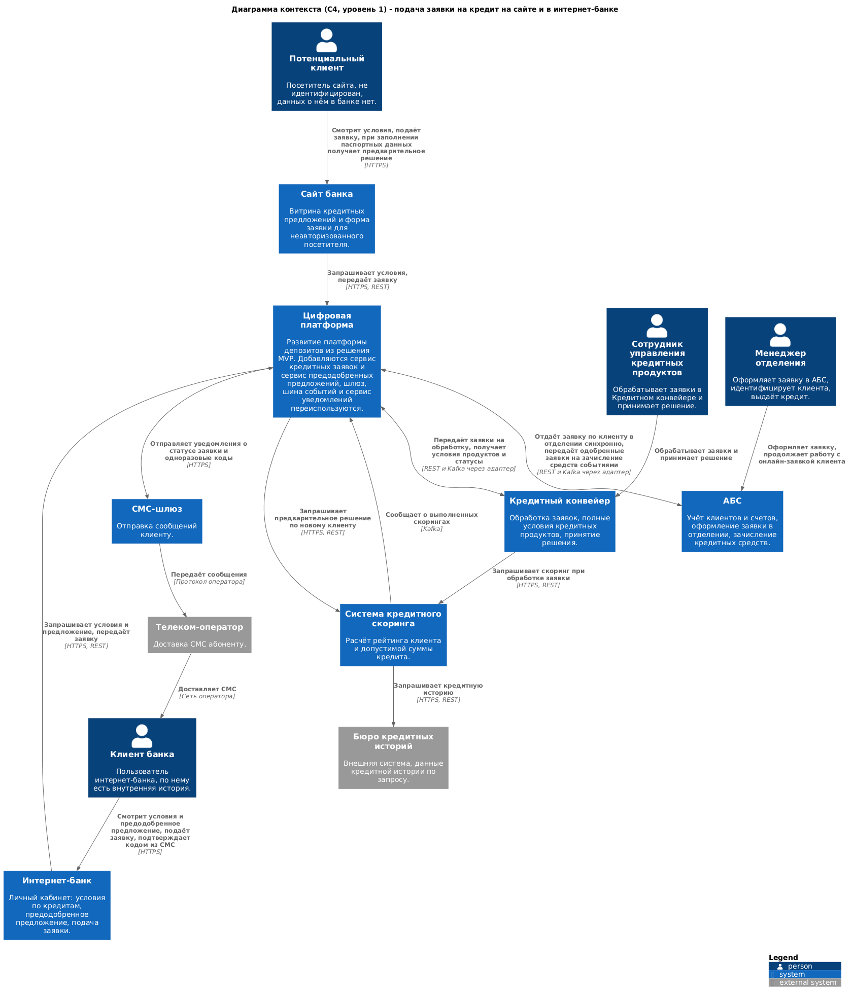
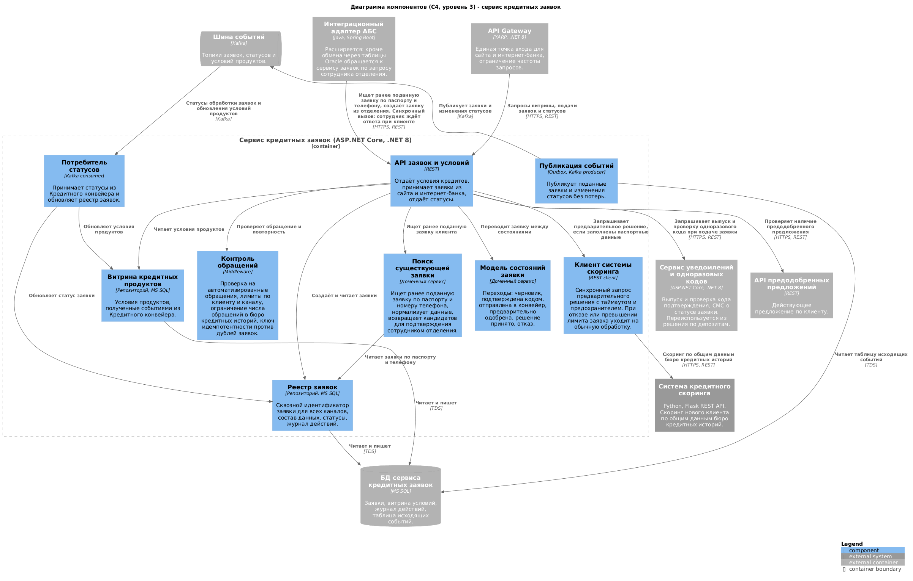
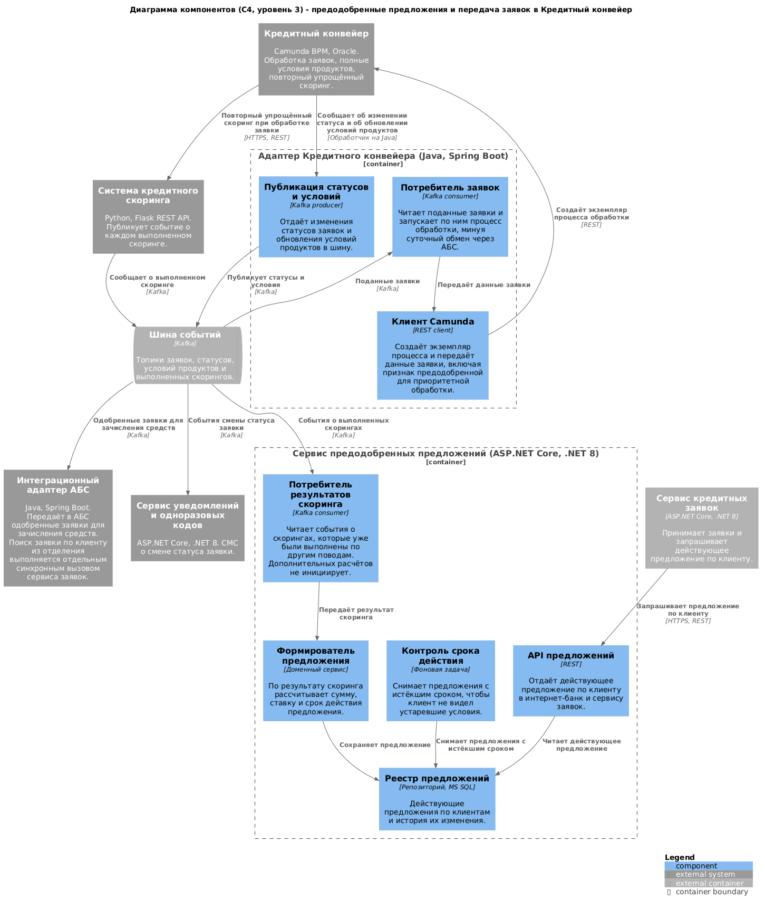

### Название задачи: подача заявки на кредит на сайте и в интернет-банке

### Автор: Vladislav

### Дата: 08.08.2026

### Функциональные требования

| **№** | **Действующие лица или системы** | **Use Case** | **Описание** |
| :-: | :- | :- | :- |
| 1 | Потенциальный клиент, Сайт банка, Сервис кредитных заявок | Просмотр кредитных предложений на сайте | 1. Посетитель открывает страницу кредитов. 2. Витрина запрашивает условия у сервиса кредитных заявок. 3. Сервис отдаёт условия из своей витрины, наполненной событиями из Кредитного конвейера. Обращения к конвейеру в момент показа страницы не происходит |
| 2 | Потенциальный клиент, Сайт банка, Сервис кредитных заявок | Подача заявки на кредит с сайта без паспортных данных | 1. Посетитель указывает Ф. И. О. и номер телефона. 2. Сервис проверяет обращение на признаки автоматизированного и на повторность. 3. Заявка сохраняется с присвоением сквозного идентификатора и публикуется событием. 4. Клиент получает сообщение, что решение будет принято после визита в отделение |
| 3 | Потенциальный клиент, Сайт банка, Сервис кредитных заявок, Система скоринга, Бюро кредитных историй | Предварительное решение по кредиту онлайн | 1. Посетитель дополнительно заполняет паспортные данные. 2. Сервис проверяет лимиты обращений и синхронно запрашивает скоринг. 3. Скоринг обращается в бюро кредитных историй, поскольку внутренних данных о клиенте нет, и возвращает оценку. 4. Клиент получает предварительное решение об одобрении или неодобрении и сумму. 5. При недоступности скоринга или превышении лимита заявка принимается и уходит на обычную обработку, о чём клиенту сообщается |
| 4 | Сервис кредитных заявок, Сервис уведомлений, Клиент | Приглашение в отделение | 1. После подачи заявки с сайта формируется событие. 2. Сервис уведомлений отправляет СМС о том, что для идентификации и получения кредита нужно прийти в отделение |
| 5 | Менеджер отделения, АБС, Сервис кредитных заявок | Продолжение онлайн-заявки в отделении | 1. Клиент приходит в отделение с документами. 2. Менеджер вводит паспортные данные в АБС. 3. АБС через адаптер запрашивает у сервиса заявок ранее поданные заявки по этому паспорту и телефону. 4. Менеджер сверяет найденную заявку с документами и подтверждает, что это тот же клиент. 5. Работа продолжается по той же заявке, повторный скоринг и новая заявка не создаются |
| 6 | Менеджер отделения, АБС, Кредитный конвейер | Создание заявки в отделении для нового клиента | 1. Совпадений по паспорту и телефону не найдено. 2. Менеджер оформляет новую заявку в АБС. 3. Заявка через адаптер попадает в сервис заявок и далее в Кредитный конвейер, не дожидаясь суточного обмена |
| 7 | Система скоринга, Сервис предодобренных предложений | Формирование предодобренного предложения | 1. Скоринг публикует событие о каждом выполненном расчёте. 2. Сервис предложений читает событие и формирует предложение: сумма, ставка, срок действия. 3. Предложение сохраняется. Дополнительные расчёты скоринга при этом не запускаются |
| 8 | Клиент банка, Интернет-банк, Сервис предодобренных предложений | Просмотр условий и предодобренного предложения | 1. Клиент открывает раздел кредитов. 2. Интернет-банк запрашивает условия продуктов и действующее предложение по клиенту. 3. Если срок действия предложения истёк, оно не показывается |
| 9 | Клиент банка, Интернет-банк, Сервис кредитных заявок, Сервис уведомлений | Подача заявки по предодобренному предложению | 1. Клиент выбирает предложение, указывает счёт зачисления и недостающие данные. 2. Сервис уведомлений выпускает одноразовый код и отправляет СМС. 3. Клиент вводит код, заявка переходит в статус «подана» и помечается признаком предодобренной. 4. Событие публикуется в шину. 5. Повторная отправка той же заявки дубликата не создаёт |
| 10 | Сервис кредитных заявок, Адаптер конвейера, Кредитный конвейер | Передача заявки в обработку | 1. Адаптер читает событие о поданной заявке. 2. Создаёт экземпляр процесса в Кредитном конвейере, передавая данные заявки и признак предодобренной. 3. Заявка попадает в очередь обработки в течение минут, а не на следующие сутки |
| 11 | Кредитный конвейер, Система скоринга | Повторный упрощённый скоринг | 1. При обработке заявки по предодобренному предложению конвейер запрашивает упрощённый скоринг. 2. Если ситуация клиента изменилась, условия пересчитываются. 3. Результат используется сотрудником при принятии решения |
| 12 | Сотрудник управления кредитных продуктов, Кредитный конвейер | Обработка заявки и решение | 1. Сотрудник видит очередь, где заявки по предодобренным предложениям идут с повышенным приоритетом. 2. Изучает данные заявки и результат скоринга. 3. Принимает решение об одобрении или отказе |
| 13 | Кредитный конвейер, Сервис кредитных заявок, Сервис уведомлений, Клиент | Информирование о статусе заявки | 1. Конвейер публикует событие о смене статуса. 2. Сервис заявок обновляет статус, клиент видит его в интернет-банке. 3. Сервис уведомлений отправляет клиенту СМС |
| 14 | Кредитный конвейер, Адаптер АБС, АБС | Зачисление кредитных средств | 1. После одобрения формируется событие о готовности к выдаче. 2. Адаптер АБС записывает данные во входящие таблицы обмена. 3. АБС проводит зачисление средств на счёт клиента и учитывает договор |

Функциональные требования, вытекающие из сценариев:

1. Условия кредитных продуктов доступны обоим каналам без обращения к Кредитному конвейеру в момент запроса.
2. Заявка на кредит принимается из сайта и из интернет-банка и получает сквозной идентификатор, единый для всех каналов и систем.
3. Заявка с сайта принимается как с паспортными данными, так и без них.
4. При заполненных паспортных данных клиент получает предварительное решение в течение единиц секунд.
5. Предварительное решение по новому клиенту строится только на общих данных бюро кредитных историй.
6. Сотрудник отделения находит ранее поданную клиентом заявку по паспорту и телефону и продолжает работу с ней.
7. Заявка, созданная в отделении, попадает в Кредитный конвейер тем же путём, что и онлайн-заявка.
8. Предодобренное предложение формируется по результатам ранее выполненных скорингов и имеет ограниченный срок действия.
9. Подача заявки в интернет-банке подтверждается одноразовым кодом из СМС.
10. Заявка по предодобренному предложению помечается признаком, который обеспечивает приоритет в очереди обработки.
11. После подачи заявки по предодобренному предложению выполняется повторный упрощённый скоринг.
12. Клиент видит статус заявки в интернет-банке и получает СМС при его изменении.
13. Повторная отправка одной и той же заявки не создаёт дубликат.
14. По каждой заявке ведётся журнал действий с указанием канала подачи.

### Нефункциональные требования

Архитектурно значимые требования отмечены отдельно, потому что именно они определили выбор решения.

| **№** | **Требование** | **Архитектурно значимое** |
| :-: | :- | :-: |
| 1 | Заявка по предодобренному предложению доступна сотруднику для обработки в течение того же рабочего дня | да |
| 2 | Существующий обмен между АБС и Кредитным конвейером остаётся суточным, ускорить его невозможно | да |
| 3 | Система кредитного скоринга не нагружается дополнительными процессами, в том числе предрасчётами скорингов | да |
| 4 | Предварительное решение на сайте выдаётся за единицы секунд, иначе сценарий теряет смысл | да |
| 5 | Недоступность скоринга или бюро кредитных историй не приводит к отказу в приёме заявки, клиент получает отложенное решение | да |
| 6 | Количество обращений в бюро кредитных историй ограничивается и контролируется, поскольку запросы платные, а форма на сайте доступна анонимно | да |
| 7 | Публичная форма заявки защищена от автоматизированных обращений | да |
| 8 | Заявка, поданная в одном канале, не дублируется при продолжении работы в другом канале | да |
| 9 | Онлайн-подача заявок не увеличивает нагрузку на базу данных АБС | да |
| 10 | Кредитный конвейер и система скоринга работают 24/7 и масштабируются горизонтально, их можно использовать без доработки под нагрузку | нет |
| 11 | Доступность сервисов подачи заявок 99,9%, режим работы 24/7 | да |
| 12 | Новые сервисы разворачиваются в двух ЦОД и масштабируются горизонтально | да |
| 13 | Передача заявок и статусов между системами выполняется без потерь, с повторными попытками | да |
| 14 | Отклик пользовательских операций измеряется миллисекундами, витрина условий отдаётся быстрее одной секунды | нет |
| 15 | Паспортные данные передаются по защищённому каналу, хранятся в защищённом виде и маскируются в журналах | да |
| 16 | Предодобренное предложение имеет срок действия, после истечения оно не показывается клиенту | нет |
| 17 | Изменения в Кредитном конвейере выполняются через обработчики на Java и REST API, без переписывания коробочного решения | да |
| 18 | В доработках используются технологии, уже применяемые в банке | нет |
| 19 | Журналы систем связаны сквозным идентификатором заявки | нет |
| 20 | Собираются метрики по доле предварительных решений, времени обработки и отказам скоринга | нет |

### Решение

#### Общая идея

Главное ограничение кредитного процесса в том, что заявка попадает в Кредитный конвейер из АБС раз в сутки, и ускорить этот обмен нельзя. Поэтому онлайн-заявка не идёт через АБС. Сервис кредитных заявок принимает её из сайта или интернет-банка, публикует событие, а адаптер создаёт процесс в Кредитном конвейере напрямую через его REST API. Существующий суточный обмен остаётся нетронутым и продолжает обслуживать прежний офлайн-процесс.

Второе ограничение в том, что систему скоринга нельзя нагружать предрасчётами, а предодобренное предложение по определению требует заранее известной оценки клиента. Решение в том, чтобы не считать скоринг заранее, а сохранять результаты тех расчётов, которые и так выполняются при обработке заявок. Скоринг публикует событие о каждом выполненном расчёте, сервис предодобренных предложений превращает его в предложение с суммой, ставкой и сроком действия. Дополнительной нагрузки не возникает.

Третье требование - непрерывность заявки между каналами. Заявка получает сквозной идентификатор в момент подачи в любом канале, а сотрудник отделения через АБС находит ранее поданную заявку по паспорту и телефону и продолжает работу с ней. Это же снимает риск двойного скоринга и двух кредитных решений по одному клиенту.

Кредитная функциональность строится на инфраструктуре, созданной для депозитов: тот же шлюз, та же шина событий, тот же сервис уведомлений и одноразовых кодов, тот же адаптер АБС. Новыми являются сервис кредитных заявок, сервис предодобренных предложений и адаптер Кредитного конвейера.

Поскольку платформа перестаёт обслуживать только депозиты, на диаграммах она называется цифровой платформой. Это та же система, что и платформа депозитов из решения MVP, с добавленными кредитными сервисами, а не новая.

#### Диаграмма контекста

Исходник: [task5-c4-context.puml](task5-c4-context.puml)

#### Диаграмма компонентов: сервис кредитных заявок

Исходник: [task5-c4-components-loan-application.puml](task5-c4-components-loan-application.puml)

#### Диаграмма компонентов: предодобренные предложения и передача заявок в конвейер

Исходник: [task5-c4-components-offers-conveyor.puml](task5-c4-components-offers-conveyor.puml)

#### Принятые решения и их обоснование

1. **Онлайн-заявки идут в Кредитный конвейер напрямую, минуя АБС.** Это единственный способ уложиться в требование обработать заявку в тот же рабочий день, не трогая суточный обмен, который ускорить запрещено. Camunda предоставляет REST API для запуска процессов, а в IT-отделе есть специалисты, которые изменяют обработчики процессов, поэтому доработка выполнима внутри банка.

2. **Заявка из отделения идёт тем же путём.** Иначе клиент, пришедший в отделение, снова попадал бы в суточный цикл, и обещание «решение за день» работало бы только для онлайн-канала. АБС передаёт заявку через тот же адаптер, что используется для депозитов.

3. **Предодобренные предложения строятся на уже выполненных скорингах.** Скоринг публикует событие о завершённом расчёте, сервис предложений его сохраняет. Так требование «не нагружать скоринг предрасчётами» выполняется буквально: ни одного дополнительного вызова не появляется. Плата за это - предложение есть не для всех клиентов, а только для тех, по кому скоринг когда-либо выполнялся.

4. **У предложения есть срок действия.** Оценка устаревает, а показывать клиенту условия, которые банк не подтвердит, нельзя. По истечении срока предложение снимается, а при подаче заявки по действующему предложению конвейер выполняет повторный упрощённый скоринг и проверяет, не изменилась ли ситуация.

5. **Сквозной идентификатор заявки и поиск по паспорту и телефону.** Заявка становится общей сущностью для сайта, интернет-банка, АБС и конвейера. Поиск возвращает не готовое решение, а кандидатов: сотрудник отделения сверяет их с документами и подтверждает совпадение. Автоматическое связывание здесь опасно, потому что заявка с сайта не идентифицирована.

   Этот сценарий единственный, где обмен с АБС синхронный: сотрудник вводит паспортные данные при клиенте и ждёт ответа, очередь тут не подходит. Поэтому интеграционный адаптер АБС, созданный для депозитов, расширяется вызовом REST API сервиса заявок. Передача одобренных заявок на зачисление средств остаётся асинхронной и идёт через шину и таблицы обмена, как в решении по депозитам.

6. **Предварительное решение на сайте выдаётся синхронным вызовом скоринга.** Это единственная синхронная интеграция в решении, и она обёрнута защитой: таймаут, предохранитель, лимиты по клиенту и каналу, ограничение числа обращений в бюро кредитных историй. Если что-то из этого срабатывает, заявка всё равно принимается и уходит на обычную обработку.

7. **Приоритет заявок по предодобренным предложениям.** Признак передаётся в конвейер вместе с заявкой и влияет на очередь сотрудника. Без приоритета обещание обработки в тот же день упирается в общий поток заявок.

8. **Витрина условий наполняется событиями из конвейера.** Полные условия продуктов живут в Кредитном конвейере, но обращаться к нему при каждом показе страницы неправильно: это система обработки, а не витрина. События дают каналам локальную копию и независимость от его доступности.

9. **Уведомления и подтверждение операции переиспользуются.** Сервис уведомлений и одноразовых кодов, созданный для депозитов, обслуживает и кредитные сценарии: сервис заявок вызывает его для выпуска и проверки кода при подаче заявки, а СМС о смене статуса отправляются по событиям из шины. Новых механизмов работы с СМС не появляется, ядро интернет-банка по-прежнему не дорабатывается.

#### Что меняется относительно решения по депозитам

Новыми являются три контейнера: сервис кредитных заявок, сервис предодобренных предложений и адаптер Кредитного конвейера. Интеграционный адаптер АБС расширяется синхронным вызовом сервиса заявок для поиска заявки по клиенту в отделении. Система кредитного скоринга дорабатывается в одном месте: начинает публиковать событие о каждом выполненном расчёте. Шлюз, шина событий, сервис уведомлений и одноразовых кодов используются без изменений.

### Альтернативы

**Отправлять онлайн-заявки в АБС и ждать суточного обмена.** Не требует ни нового сервиса, ни изменений в конвейере, весь поток заявок остаётся единым. Отклонено: решение по заявке появлялось бы через сутки и более, то есть цель «решение в течение одного дня» не достигается ни в одном сценарии.

**Ускорить обмен между базами данных АБС и Кредитного конвейера.** Самый прямой путь: ничего не меняя в архитектуре, увеличить частоту синхронизации. Отклонено прямым ограничением из условия: ускорить обмен невозможно.

**Считать скоринг заранее для всех клиентов ночным пакетным процессом.** Предодобренное предложение было бы у каждого клиента, а не только у тех, кого скоринг уже касался. Отклонено: это ровно тот предрасчёт, который запрещён требованием, и он создаёт нагрузку на систему, критичную для работы банка.

**Хранить предодобренные предложения в Кредитном конвейере.** Предложение концептуально близко к кредитному процессу, и данные лежали бы рядом с условиями продуктов. Отклонено: конвейер рассчитан на обработку заявок сотрудниками, а не на обслуживание запросов из клиентских каналов. Витрина в отдельном сервисе даёт нужное время отклика и не зависит от загрузки конвейера.

**Обращаться из канала к скорингу напрямую, минуя сервис заявок.** Меньше звеньев, быстрее ответ. Отклонено: тогда лимиты обращений, защита от автоматизированных запросов и учёт заявок оказались бы размазаны по каналам, а бюро кредитных историй можно было бы дёргать анонимно и без контроля.

**Синхронно вызывать Кредитный конвейер при подаче заявки вместо публикации события.** Клиент сразу получал бы подтверждение, что заявка заведена в обработку. Отклонено: недоступность конвейера означала бы отказ в приёме заявки, а нагрузка от пиков подачи ложилась бы на систему обработки напрямую.

**Расширить сервис депозитных заявок вместо создания отдельного сервиса.** Общий сервис заявок выглядит экономнее. Отклонено: жизненный цикл кредитной заявки существенно сложнее депозитной, у неё скоринг, предодобренные предложения, приоритеты и решение сотрудника. Общий сервис быстро стал бы новым монолитом. Инфраструктура при этом переиспользуется целиком.

**Недостатки, ограничения, риски**

1. **Появляется два пути доставки заявок в конвейер.** Новый онлайн-канал работает через адаптер, старый суточный обмен продолжает работать для прежнего процесса. Пока оба живы, возможны расхождения в данных и двойные заявки, поэтому нужен контроль пересечений и план вывода старого канала из эксплуатации.

2. **Предварительное решение по новому клиенту опирается только на данные бюро кредитных историй.** Внутренней истории по нему нет, поэтому качество оценки ниже. Решение обязательно должно доводиться до клиента как предварительное и не связывать банк обязательством.

3. **Запросы в бюро кредитных историй платные, а форма на сайте анонимна.** Даже с лимитами и защитой от ботов остаётся риск роста расходов при массовых обращениях. Нужен постоянный контроль числа запросов и стоимости на одну поданную заявку.

4. **Предодобренные предложения есть не для всех клиентов.** Предложение появляется только у тех, по кому скоринг уже выполнялся ранее. Для остальных сценарий в интернет-банке ничем не отличается от обычной заявки, и ожидания бизнеса по охвату могут не совпасть с реальностью.

5. **Предложение может устареть между показом и подачей.** Ситуация клиента меняется, поэтому повторный упрощённый скоринг способен ухудшить условия по сравнению с теми, что клиент видел. Это нужно явно объяснять в интерфейсе, иначе появятся жалобы.

6. **Сопоставление онлайн-заявки с клиентом в отделении остаётся ручным.** Заявка с сайта не идентифицирована, совпадение по Ф. И. О. и телефону не доказывает, что это тот же человек. Ответственность за подтверждение лежит на сотруднике, а значит возможны ошибки в обе стороны.

7. **Обещание обработать заявку в тот же рабочий день зависит от людей.** Архитектура доставляет заявку в конвейер за минуты, но решение принимает сотрудник. Без приоритетной очереди, нормирования и контроля времени обработки требование не выполняется никакой технической частью.

8. **Онлайн-заявки добавляют нагрузку на систему скоринга в рабочие часы.** Предрасчётов нет, но синхронные запросы с сайта приходят именно днём, когда скоринг и так загружен. Нужны лимит на канал, приоритезация и наблюдение за временем ответа.

9. **Зависимость от возможностей Кредитного конвейера.** Запуск процессов через REST API и публикация статусов обработчиками на Java опираются на коробочное решение, часть изменений согласуется с подрядчиком внедрения. Это влияет на сроки и на глубину возможных доработок.

10. **Зачисление средств остаётся на стороне АБС.** Решение по заявке принимается быстро, но проводка выполняется в АБС и подчиняется её регламентам, поэтому фактическая выдача денег может отставать от решения. Клиенту нужно сообщать срок именно решения, а не зачисления.

11. **Паспортные данные попадают в публичный канал.** Это повышает требования к защите и делает сайт привлекательной целью. Требуются шифрование канала и хранения, маскирование в журналах, ограничение срока хранения черновиков заявок и контроль доступа к ним.
